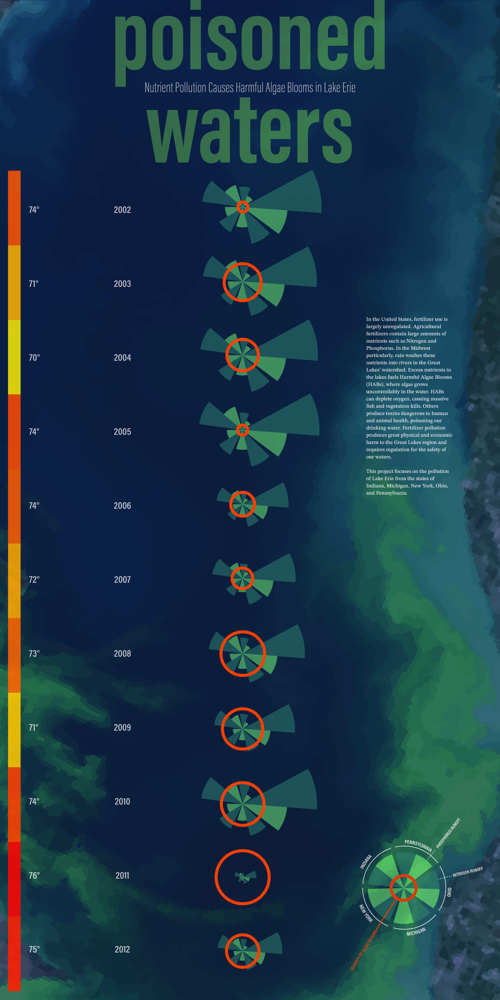
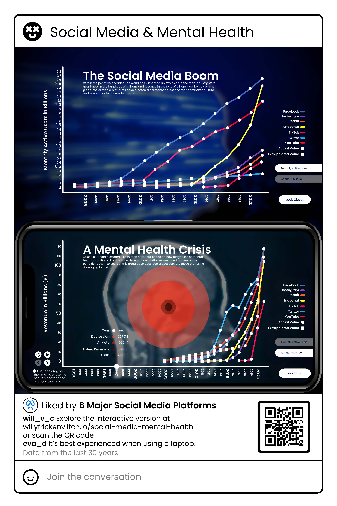
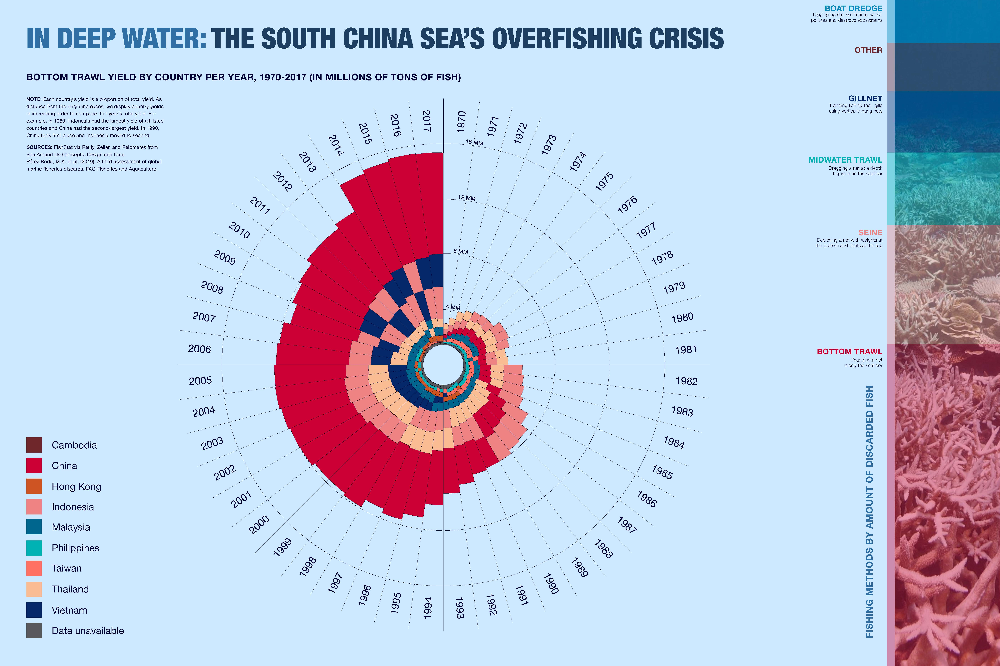

The fun part about having my own website is that I can be creative and showcase some of my passion projects!

I've always believed that data visualization is a beautiful intersection of science communication, art and design, and information science. So much environmental data is collected every moment, but it often exists in messy spreadsheets and raw numbers—formats that the human brain struggles to interpret.

To me, visualizing environmental data in ways that are not only understandable to the general public but also beautiful and inspiring is one of the most powerful ways to communicate climate science. It’s one thing to see a viral video of a polar bear and her cubs struggling to find food in the melting Arctic, but it’s another to pair that image with real-life data—graphs showing the rapid decline of Arctic biodiversity.

As scientists, we often exist in an academic bubble, using technical language that can feel isolating and inaccessible. My goal is to use data visualization to bridge that gap—to engage the public in complex environmental issues and spark meaningful conversations, using art as the **impetus**.

Below are links to some of my favorite data artists, along with examples of my own work in environmental data visualization.

- [Jer Thorp Website](https://www.jerthorp.me/)
- [Insect Apocalypse Visualization](https://www.reuters.com/graphics/GLOBAL-ENVIRONMENT/INSECT-APOCALYPSE/egpbykdxjvq/)

My favorite class I took at Notre Dame was Data Visualization with Dr. Neeta Verma. It was my first design class and I had so much fun!

[Dr. Neeta Verma portfolio](https://www.designv.us/work)

Here is some of the work I created in her class:

_Poisoned Waters: A data visualization on water pollution, by Eva Deegan and Lauren Fricker._

_Page_1.jpg>)
_America’s Education Race: Visualizing disparities in the Dallas school system, by Eva Deegan and Malachi Snyder._

_Social Media & Science: How social media impacts mental health — an interactive data visualization, by Eva Deegan and William Ventura-Chavez._

I was so inspired by my classmates' environmental data visualizations too. Here are some examples:

**Classmate’s Work:** _COVID-19’s impact on atmospheric pollution, by Yi Suhyeon and Alissa Svoboda._

**Classmate’s Work:** _Coral bleaching and conservation trends, by Joseph Neus and Daniela Mantica._

**Classmate’s Work:** _The South China Sea’s overfishing crisis, by Callie Whelan and Peter Grissom._

**Classmate’s Work:** _The World in Waste, by Malachi Snyder and Tristan Huo._
