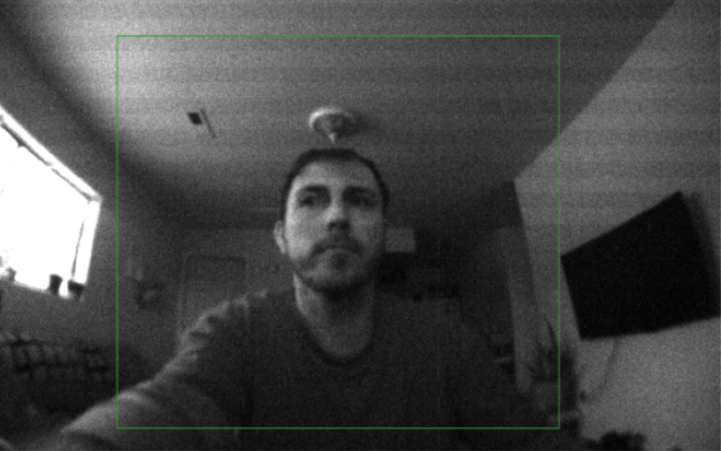

 

 

# `I'm Jacob`

 

I'm a Ph.D. student in Informatics and graduate research assistant under [Dr. Igor Steinmacher](https://scholar.google.com/citations?user=I8o8rfoAAAAJ&hl=en) and [Dr. Marco Gerosa](https://scholar.google.com/citations?user=kjtuhEQAAAAJ&hl=en) in the [RESHAPE Lab](https://www.reshapelab.site) @ Northern Arizona University. I study in the field of Human-Computer Interaction, focusing on the intersection of programming education and AI. I also sometimes contribute to Machine Learning research, particularly on multi‑label classifiers.

 

:::note[Find more at…]
- [My curriculum vitae](../../static/img/jacob-penney_cv.pdf)
- [Google Scholar](https://scholar.google.com/citations?user=4maC0rUAAAAJ&hl=en&oi=ao)
- [ResearchGate](https://www.researchgate.net/profile/Jacob-Penney-2/research)
- [GitHub](https://github.com/mcauley-penney)
- [LinkedIn](https://www.linkedin.com/in/jacob-m-penney)
:::

 

Last updated October 2025
