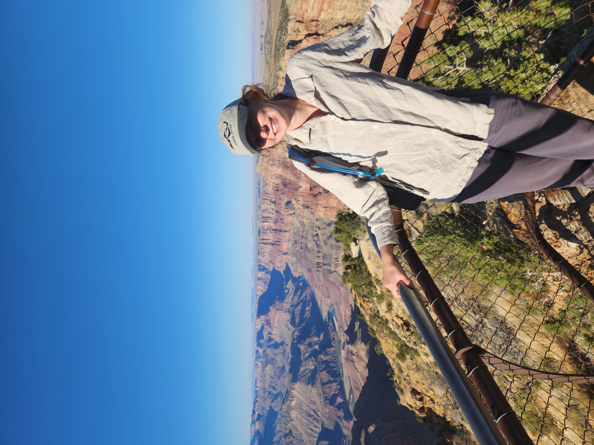

# About Me

Hi, I am a PhD student in Eco-Informatics at Northern Arizona University, working with Dr. Kiona Ogle. My research applies Bayesian statistical methods to model the distributions of C3 and C4 grass species and their environmental drivers across National Parks in the western United States. I am interested in how plants respond to climate stressors—particularly drought and disturbance—and how these responses scale to affect ecosystem function and inform land management.

I earned my B.S. in Environmental Science with a Data Science minor from the University of Notre Dame in 2023. There, I worked with Dr. Stuart Jones on projects integrating drought-induced changes in plant water use efficiency in modeling lateral carbon transport between terrestrial and aquatic ecosystems. After graduating, I joined AmeriCorps and collaborated with the National Park Service on fire ecology research, where I developed code to analyze post-fire vegetation data and provided management recommendations for Douglas-fir populations in the Rincon Mountains of Arizona.

I am passionate about leveraging large ecological datasets, statistical modeling, and data visualization to support science-based conservation and land stewardship!

This is my personal website where I showcase my research, publications, and presentations. Feel free to explore my work!
