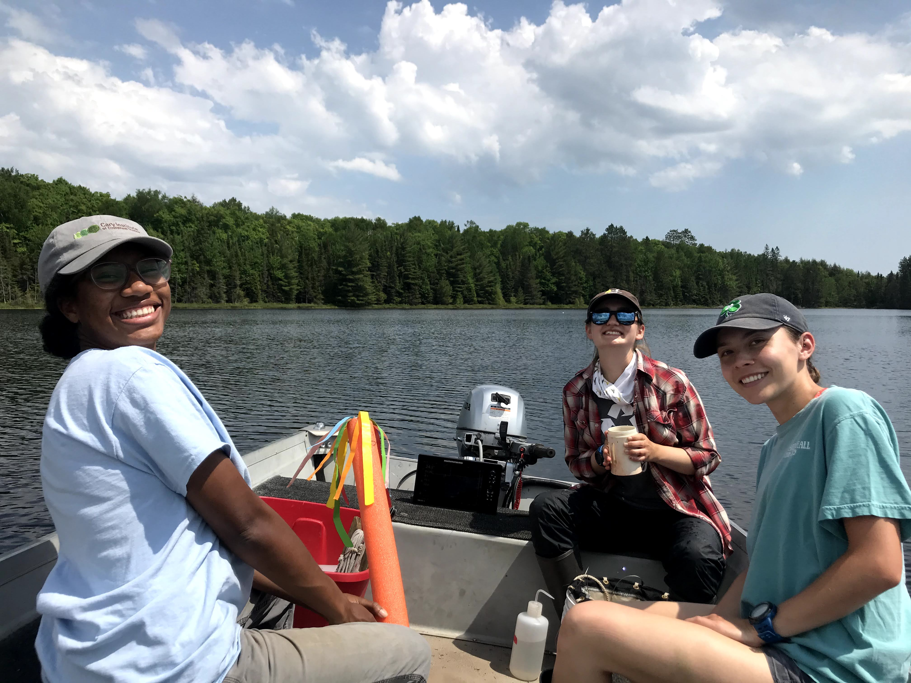
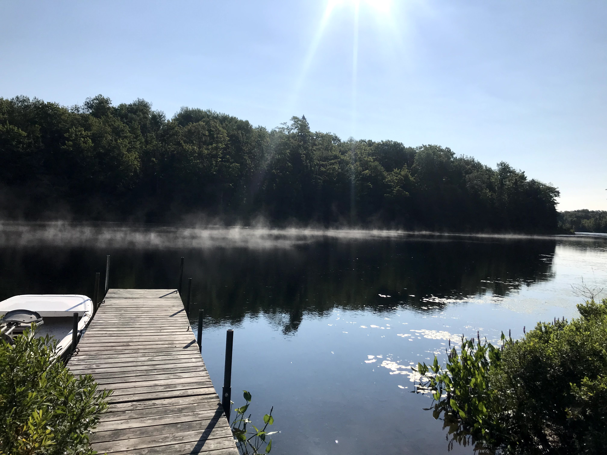
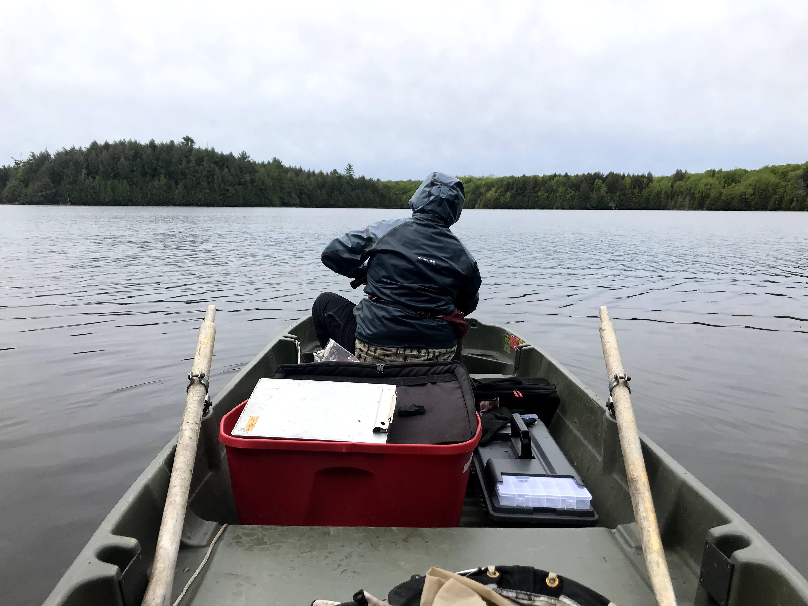
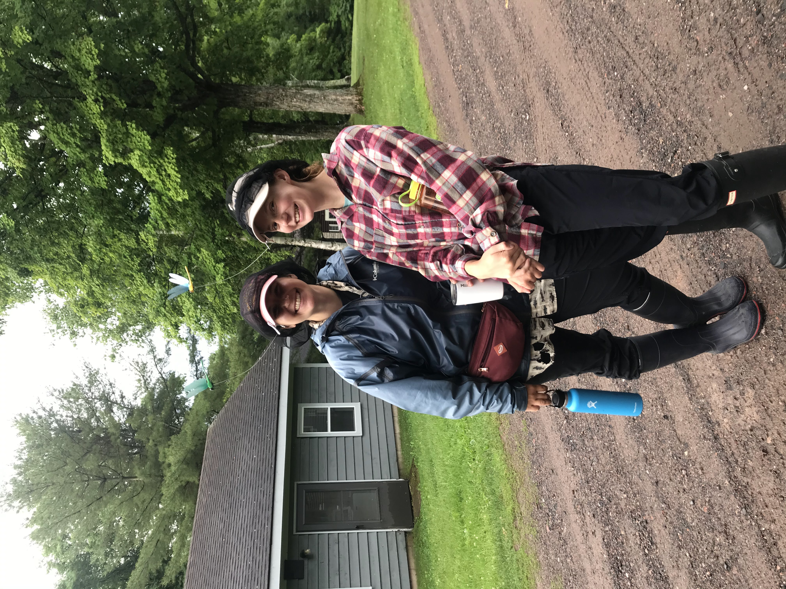
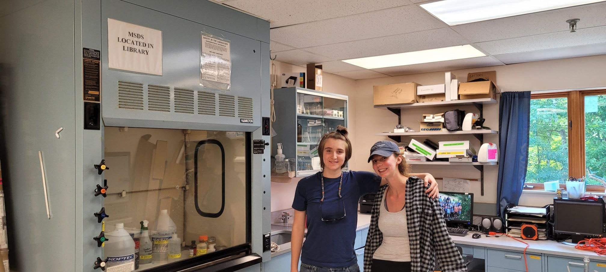
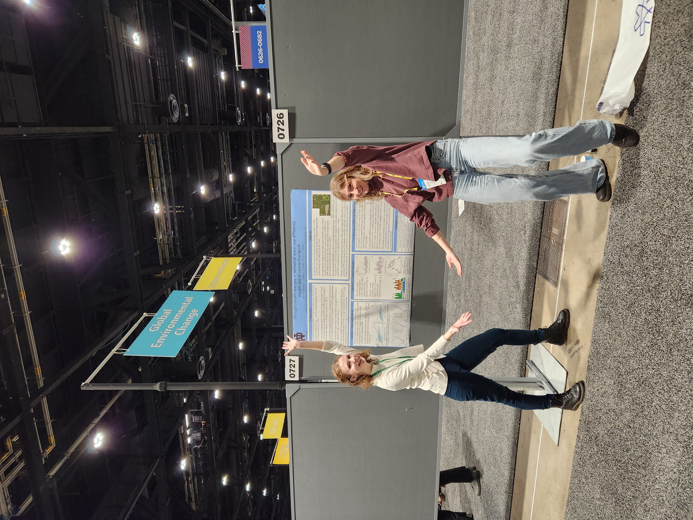
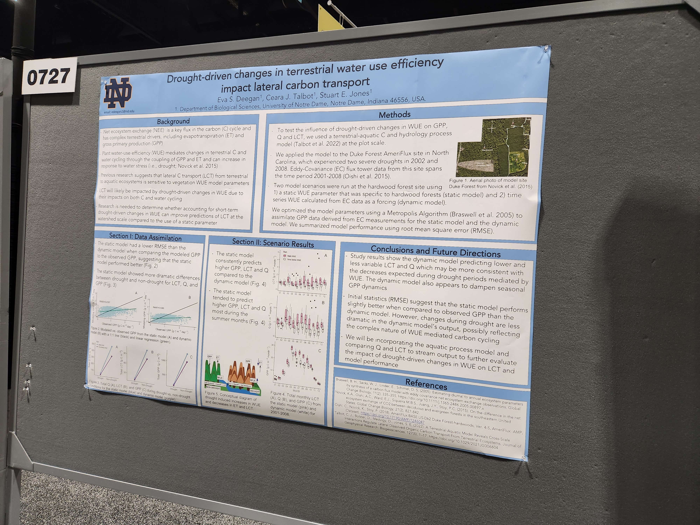
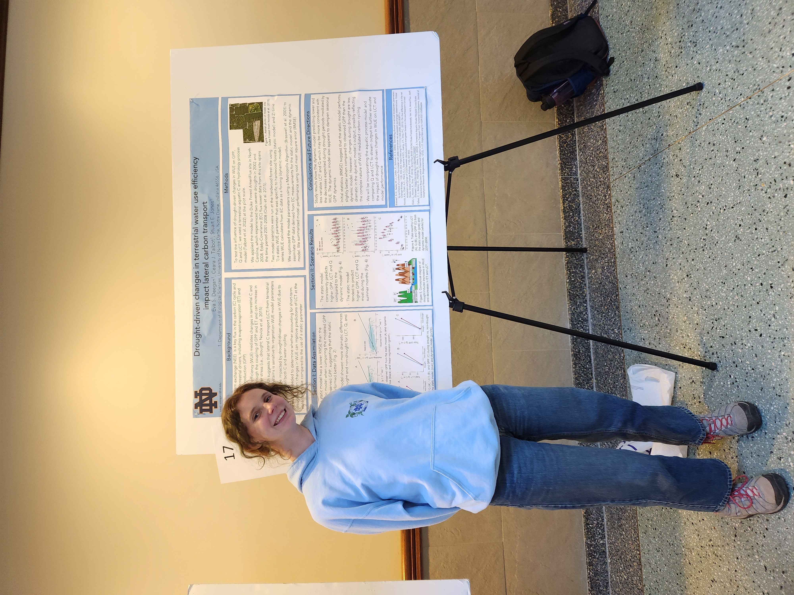
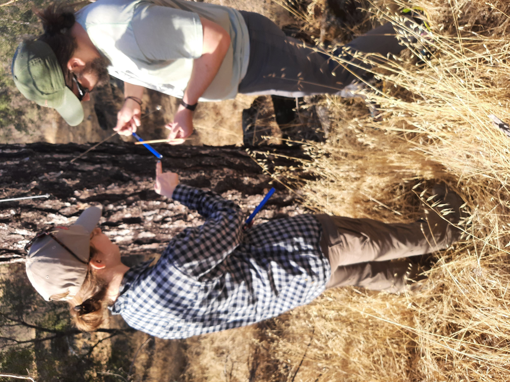
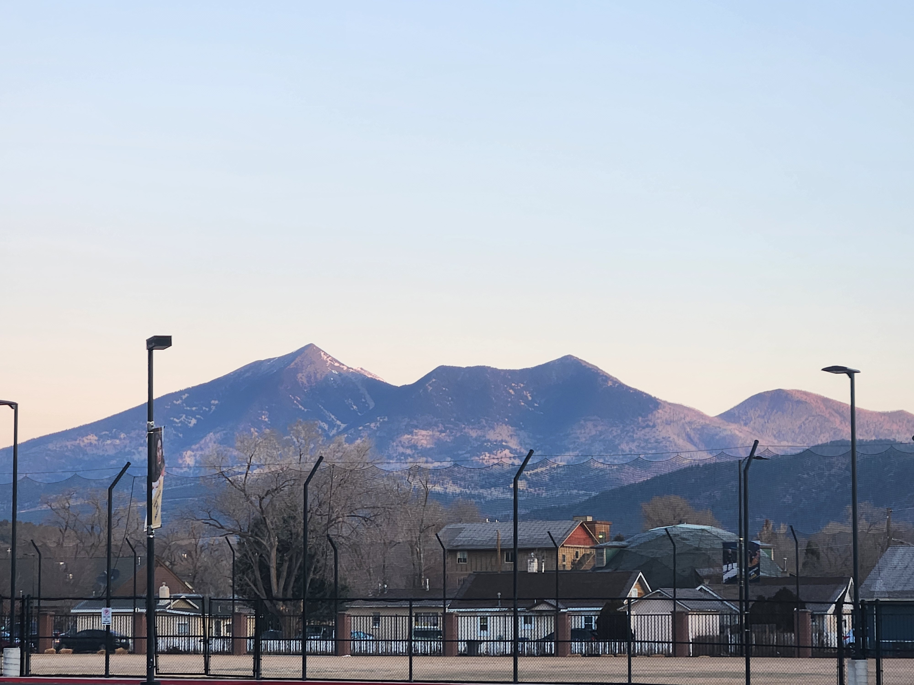

# Research Projects

## 🧪 Modeling Carbon Flux in Aquatic Ecosystems

Investigating how carbon cycles in freshwater ecosystems using computational models.

### Research Overview

This project investigates **lateral carbon transport** between terrestrial and aquatic ecosystems. It combines **field data from freshwater lakes** with **computational modeling** to improve predictions of carbon flux.

### Early Research in Dr. Stuart Jones’s Lab

In my **sophomore year** at the University of Notre Dame, I joined **Dr. Stuart Jones’s lab**, working on the **limnology team**.

- Conducted **aquatic water sampling** in the lab.
- Measured **nitrogen, phosphorus, and carbon content** in lake water.
- Developed fundamental skills in **ecological monitoring and analysis**.

### Summer Fieldwork at UNDERC (2021)

During the **summer of 2021**, I worked at the **University of Notre Dame Environmental Research Center (UNDERC)** in **northern Wisconsin**, a **NEON (National Ecological Observatory Network) site**.

- **Field Sampling:** Collected **temperature, light, color, and carbon content** data from **12+ lakes**.
- **Lab Analysis:** Processed samples, filtered water, and analyzed carbon content.
- **Long-term Monitoring:** Contributed to an ongoing **limnology dataset**.

  **Impact:** This immersive field experience **sparked my passion for research** and led me to consider **graduate school**.

### Modeling Carbon Transport with Dr. Ceara Talbot

After the summer at UNDERC, I collaborated with **Dr. Ceara Talbot** (then a graduate student in the Jones lab, now at Carnegie Science Institute) to work on:

- A **dual-process terrestrial-aquatic carbon transport model**.
- Investigating **sensitive terrestrial parameters** affecting lateral carbon movement.
- Analyzing **water use efficiency changes in response to drought**.
- Implementing **dynamic water use efficiency data** into the **lateral carbon transport model**.

**Goal:** To **improve predictions** of carbon transport across land and water.

### Presenting at AGU 2022

In **December 2022**, I presented this research at the **American Geophysical Union (AGU) Conference**:

- Shared findings on **drought-driven water use efficiency changes**.
- Explored how **terrestrial dynamics influence lake carbon flux**.
- Engaged with experts in **ecology, hydrology, and climate modeling**.

### Key Takeaways

✔ Hands-on **field and lab experience** at **UNDERC (NEON site)**.
✔ Advanced **carbon cycle modeling** with **Dr. Ceara Talbot**.
✔ **Presented research at AGU 2022**, engaging with top climate scientists.

## 🌲 Fire Ecology in U.S. National Parks

Analyzing wildfire trends and ecological impacts in national parks.

### Research Overview

This project focused on **modernizing fire effects data analysis** for the **National Park Service (NPS)** by developing R-based **quality control** and **data analysis workflows**. It also contributed to **community building in NPS fire ecology** through mentorship, presentations, and collaboration.

### Moving to Tucson & Transition to Fire Ecology

After graduating from Notre Dame, I started a **Scientist in Parks** internship as a **Fire Ecology Assistant** in **Tucson, Arizona**.

- **A major shift from the Midwest**—this was my first experience living in the desert.
- **Excited to explore desert ecology and fire science** through a **year-long internship**.

### The 20+ Year Fire Effects Dataset Challenge

The **fire ecology program** in Southern Arizona maintained a **20+ year fire effects dataset**, passed between many different fire ecologists.

- **Problems:**
  - Data had **errors, inconsistencies, and gaps**.
  - No **standardized quality control (QA/QC)** or workflow for analysis.
- **Solution:** I independently proposed creating an **R package** to systematically check and analyze the data.

### Developing R Packages for Fire Data

I created **two R packages** to **streamline fire data quality control and analysis**:
**[FFI QAQC](https://github.com/gldejong/FFIqaqc)** → A package to **detect data issues** in fire effects monitoring.
**[FFI Analysis](https://github.com/gldejong/FFIanalysis)** → A package for **automated fire data analysis and reporting**.

**Key Contributions**:

- Designed a **reproducible workflow** for fire data quality control.
- Created **automated reports** for **NPS fire managers** to use in decision-making.
- Improved **data transparency and efficiency** within the fire program.

### Final Analysis Report on the 2002 Fire

As part of this project, I produced a **final analysis report** on a **2002 fire**, conducting:

- **Data analyses** on long-term fire effects
- **Management recommendations** based on fire severity trends
- A discussion with fire managers about **future fire mitigation strategies**

💡 **Impact:** This report sparked an in-depth discussion among NPS fire managers about refining **long-term fire monitoring strategies**.

### Founding the NPS Fire Ecology R Working Group

Recognizing the **lack of structured R support**, I helped establish the **NPS Fire Ecology R Working Group**:

- **A national community** of fire ecologists discussing R-based workflows.
- **Monthly meetings** to discuss **coding challenges, best practices, and data analysis**.
- This **group still meets today**, supporting NPS-wide fire data analysis!

### Nationwide Presentations & Policy Impact

I presented my work to:
✔ **NPS Inventory & Monitoring Data Managers** – Highlighting the impact of fire ecology QA/QC.
✔ **National Park Service Fire Ecologists (Nationwide Call)** – Led a discussion on **modernizing fire data analysis**.
✔ **Committee for FFI Database Improvements** – Ongoing involvement in **enhancing fire data quality**.

**Key Takeaway:** This project didn’t just improve **one dataset**—it started a **system-wide shift** toward better fire data management in **NPS Fire Ecology**.

### 2024 NPS Regional Fire Management Achievement Award

For my contributions to **fire data modernization, software development, and community leadership**, I was honored to receive the **2024 NPS Regions 6,7,8 Fire Management Achievement Award**.

### Fieldwork & Personal Growth

Alongside data analysis, I participated in **fire effects field trips** with the **Inventory & Monitoring Network**, collecting real-world data on:

- **Vegetation recovery after fire**
- **Fuel loads and fire severity**
- **Long-term ecological changes**

  **My time at the Desert Research Learning Center (DRLC) and in Tucson was transformational.**

- **Gained a lifelong passion** for fire ecology.
- **Committed to educating others about fire science**.
- **Continue to stay involved with NPS Fire Ecology** to this day.

### Key Takeaways

✔ Developed **R-based QA/QC & analysis tools** for **NPS fire ecology**.
✔ Founded the **NPS Fire Ecology R Working Group**, which still meets today.
✔ Presented research to **nationwide audiences** of **fire ecologists & managers**.
✔ **Produced a 2002 fire analysis report** that influenced **management discussions**.
✔ **Received the 2024 NPS Regional Fire Management Achievement Award**.
✔ **Continue to stay involved with NPS Fire Ecology efforts**.

## 🌾 Bayesian Modeling of C3 & C4 Grass Distributions

Using Bayesian methods to model how climate affects C3 & C4 grass distributions.

### Research Overview

This project uses Bayesian statistical modeling to analyze the distribution of C3 and C4 grasses across the western United States. Using National Park Service inventory and monitoring vegetation data, we aim to understand what drives species distribution patterns today and how climate change may impact them in the future.

### Beginning My PhD at Northern Arizona University

In Fall 2024, I began my PhD in Informatics and Computing with an emphasis on ecology at Northern Arizona University.

- Northern Arizona is a hub for ecological research, with diverse landscapes and opportunities to study ecoinformatics.
- The Ecoinformatics program is the perfect combination of my interests in ecology and data science.
- I joined Dr. Kiona Ogle’s Ecological Synthesis Lab, where we use quantitative methods to answer ecological questions.

### Working with National Park Service Vegetation Data

This year, I started a project using National Park Service (NPS) inventory and monitoring data to study grass species distribution.

- We are working with six different NPS Inventory & Monitoring networks.
- The goal is to model the probability of C3 and C4 grass presence across a large geographic range from Texas to Montana.

### Bayesian Modeling to Study Climate Drivers

We are using a Bayesian statistical model to analyze:

- Which climate factors influence grass distributions today
- What environmental conditions favor C3 vs. C4 grasses
- How these distributions may shift with climate change

This model allows us to quantify uncertainty and improve predictions of how grass species may respond to future climate scenarios.

### Looking Ahead

I am really enjoying my PhD experience in Arizona and excited to continue:

- Expanding my Bayesian modeling skills
- Collaborating with NPS and the ecological research community
- Applying data science techniques to real-world conservation challenges

### Key Takeaways

✔ Started a PhD at NAU focusing on ecoinformatics
✔ Working with National Park Service vegetation monitoring data
✔ Developing a Bayesian model to study C3 and C4 grass distributions
✔ Investigating climate drivers of species distribution patterns
✔ Exploring how grass distributions may change with climate change

